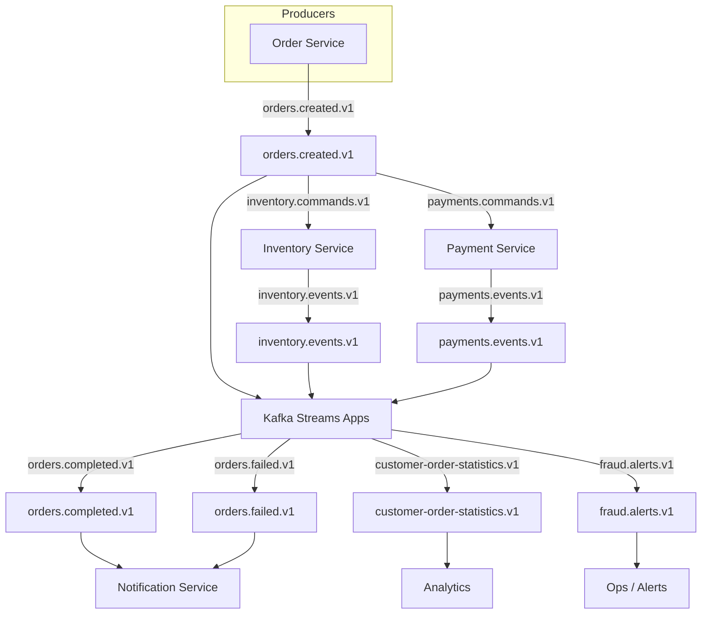

# Kafka Practical Lab

A production-quality, educational Java 21 project for learning Apache Kafka through progressive practical exercises. The platform models an event-driven order-processing system that evolves across lab milestones.

---

## Architecture



---

## Prerequisites

| Tool | Version |
|---|---|
| Java | 21 |
| Maven | 3.9+ (or use `./mvnw`) |
| Docker | 24+ with Compose v2 |

---

## Quick Start

```bash
# 1. Start the local Kafka environment
make up

# 2. Wait for Kafka to be ready
bash scripts/wait-for-kafka.sh

# 3. Provision all topics
make topics

# 4. Build the project
make build

# 5. Send 10 test orders
make produce

# 6. Consume and log orders (Ctrl+C to stop)
make consume
```

---

## Docker Services and Ports

| Service | Image | Port | URL |
|---|---|---|---|
| Kafka (KRaft) | `confluentinc/cp-kafka:7.9.0` | `9092` | `localhost:9092` |
| Schema Registry | `confluentinc/cp-schema-registry:7.9.0` | `8081` | `http://localhost:8081` |
| AKHQ | `tchiotludo/akhq:0.27.1` | `8080` | `http://localhost:8080` |

All containers share the `kafka-lab` Docker bridge network. Other containers reach Kafka at `kafka:29092`.

---

## Starting and Stopping Kafka

```bash
# Start all services
make up
# or
docker compose -f docker/compose.yaml up -d

# Stop (data preserved)
make down
# or
docker compose -f docker/compose.yaml down

# Stop and remove all data (destructive — prompts for confirmation)
make reset
# or
bash scripts/reset-environment.sh
# or without prompt
bash scripts/reset-environment.sh --destroy
```

### Alternative topologies

```bash
# Single-broker (same as default)
docker compose -f docker/compose-single-broker.yaml up -d

# Three-broker cluster (replication exercises)
docker compose -f docker/compose-three-brokers.yaml up -d
COMPOSE_FILE=docker/compose-three-brokers.yaml \
  KAFKA_SERVICE=kafka1 \
  BOOTSTRAP_SERVERS=localhost:9092 \
  bash scripts/wait-for-kafka.sh
COMPOSE_FILE=docker/compose-three-brokers.yaml \
  KAFKA_SERVICE=kafka1 \
  REPLICATION_FACTOR=3 \
  bash scripts/create-topics.sh
```

---

## Provisioning Topics

```bash
# Via Makefile
make topics

# Via AdminClient module directly
./mvnw -pl plain-java/admin-client exec:java \
  -Dexec.mainClass=com.example.kafkalab.admin.AdminClientMain

# Three-broker replication
./mvnw -pl plain-java/admin-client exec:java \
  -Dexec.mainClass=com.example.kafkalab.admin.AdminClientMain \
  '-Dexec.args=--replication-factor 3'

# Via shell script (uses kafka-topics inside Docker)
bash scripts/create-topics.sh
```

The provisioner creates missing topics, leaves compatible existing topics unchanged, and exits non-zero on unrecoverable errors. It never deletes or recreates topics automatically.

---

## Running the Producer

```bash
# Default: 10 orders across 5 customers to orders.created.v1
make produce

# Custom arguments
./mvnw -pl plain-java/producer exec:java \
  -Dexec.mainClass=com.example.kafkalab.producer.ProducerMain \
  '-Dexec.args=--bootstrap-servers localhost:9092 --topic orders.created.v1 --count 20 --customer-count 3'

# Or after packaging
java -jar plain-java/producer/target/producer-1.0.0-SNAPSHOT.jar \
  --bootstrap-servers localhost:9092 \
  --topic orders.created.v1 \
  --count 10 \
  --customer-count 5
```

The producer uses `acks=all`, idempotence enabled, `lz4` compression, and sends callbacks asynchronously. It exits non-zero if any send fails.

---

## Running the Consumer

```bash
# Default: reads orders.created.v1 with group order-audit-consumer
make consume

# Custom arguments
./mvnw -pl plain-java/consumer exec:java \
  -Dexec.mainClass=com.example.kafkalab.consumer.ConsumerMain \
  '-Dexec.args=--bootstrap-servers localhost:9092 --topic orders.created.v1 --group-id order-audit-consumer'
```

The consumer uses manual offset commits, `enable.auto.commit=false`, and commits partition-specific offsets after successful processing. Use `Ctrl+C` for graceful shutdown.

---

## Opening AKHQ

AKHQ provides a web UI for inspecting topics, messages, consumer groups, and schemas.

```
http://localhost:8080
```

You can browse:
- **Topics** — view partitions, messages, and offsets
- **Consumer Groups** — view lag per partition
- **Schema Registry** — view registered Avro schemas
- **Kafka Connect** *(if configured)*

---

## Inspecting Consumer Groups

```bash
# List all groups and describe order-audit-consumer
bash scripts/inspect-consumer-groups.sh

# Describe a specific group
GROUP_ID=my-group bash scripts/inspect-consumer-groups.sh

# Using docker compose directly
docker compose -f docker/compose.yaml exec kafka \
  kafka-consumer-groups --bootstrap-server localhost:9092 --list

docker compose -f docker/compose.yaml exec kafka \
  kafka-consumer-groups --bootstrap-server localhost:9092 \
  --describe --group order-audit-consumer
```

---

## Resetting the Environment

```bash
# Stop containers, keep data
make down

# Stop containers and remove all volumes (destructive)
make reset

# Non-interactive reset (CI / scripted use)
DESTROY_VOLUMES=true bash scripts/reset-environment.sh --destroy
```

---

## Makefile Targets

| Target | Description |
|---|---|
| `make up` | Start all Docker services |
| `make down` | Stop Docker services (preserve data) |
| `make reset` | Stop and remove all data (prompts) |
| `make topics` | Provision all Kafka topics |
| `make build` | Compile all modules (skip tests) |
| `make test` | Run unit tests |
| `make verify` | Full build + unit + integration tests |
| `make produce` | Run the plain-java producer (10 orders) |
| `make consume` | Run the plain-java consumer |
| `make transactional` | Run the transactional processor |
| `make logs` | Tail Docker logs |

---

## Module Overview

### Implemented

| Module | Description |
|---|---|
| `plain-java/common` | `OrderCreated` record, `TopicDefinition`, `KafkaDefaults`, `JsonSerde` (Jackson) |
| `plain-java/producer` | Idempotent `KafkaProducer<String,String>` with headers and async callbacks |
| `plain-java/consumer` | Manual-commit `KafkaConsumer<String,String>` with graceful shutdown |
| `plain-java/admin-client` | `TopicProvisioner` using Kafka AdminClient; provisions all 10 topics |
| `plain-java/transactional-processor` | Exactly-once read-process-write with Kafka transactions |

### Planned (placeholder modules)

| Module | Intended purpose |
|---|---|
| `avro-clients/avro-producer` | Produce `OrderCreated` using `KafkaAvroSerializer` and Schema Registry |
| `avro-clients/specific-consumer` | Consume with generated `SpecificRecord` classes |
| `avro-clients/generic-consumer` | Consume with `GenericRecord` — no generated code needed |
| `spring-services/order-service` | Spring Boot REST API that publishes `OrderCreated` events |
| `spring-services/inventory-service` | `@KafkaListener` consumer with Spring retry and DLT |
| `spring-services/payment-service` | `@KafkaListener` with transactional outbox pattern |
| `spring-services/notification-service` | Sends notifications on order completion/failure |
| `streams/order-statistics` | Kafka Streams windowed aggregation of order totals |
| `streams/order-payment-join` | Stream-stream join to correlate orders with payments |
| `streams/suspicious-order-detector` | Pattern detection / fraud alerts using sliding windows |
| `load-tests` | Throughput and latency benchmarking |

---

## Learning Roadmap

Follow the exercises in this order:

1. **Local environment** — start Docker, understand KRaft, listeners, and networks (`docs/local-environment.md`)
2. **Topic management** — provision topics with `AdminClient`, understand partition and replication strategy (`docs/topic-catalog.md`)
3. **Plain Java producer** — `KafkaProducer` basics, idempotence, headers, async callbacks (`plain-java/producer`)
4. **Plain Java consumer** — `KafkaConsumer` basics, manual offset commits, graceful shutdown (`plain-java/consumer`)
5. **Delivery semantics** — at-most-once, at-least-once, offset commit timing (`docs/delivery-semantics.md`)
6. **Transactions** — exactly-once Kafka-internal, `transactional.id`, read-process-write (`plain-java/transactional-processor`)
7. **Avro & Schema Registry** — binary serialisation, schema evolution, compatibility modes (`docs/schema-evolution.md`, `avro-clients/`)
8. **Spring Boot services** — `@KafkaListener`, `KafkaTemplate`, retry, DLT (`spring-services/`)
9. **Kafka Streams** — topology DSL, stateful operations, joins, windowing (`streams/`)
10. **Load testing** — throughput, latency, tuning (`load-tests/`)

---

## Current Implementation Status

### ✅ Complete

- [x] Root Maven multi-module build (Java 21, Spring Boot BOM, Testcontainers BOM)
- [x] Maven Wrapper (3.9.9)
- [x] `plain-java/common` — `OrderCreated`, `TopicDefinition`, `KafkaDefaults`, `JsonSerde`
- [x] `plain-java/producer` — idempotent JSON producer with headers
- [x] `plain-java/consumer` — manual-commit consumer with graceful shutdown
- [x] `plain-java/admin-client` — `TopicProvisioner` with safety guarantees
- [x] `plain-java/transactional-processor` — exactly-once Kafka-to-Kafka transactions
- [x] Docker Compose (single-broker, three-broker)
- [x] Schema Registry and AKHQ
- [x] Bash scripts (wait, create-topics, produce, inspect, reset)
- [x] Unit tests (50 tests, all green)
- [x] `TopicProvisionerIT` integration test (Testcontainers)
- [x] GitHub Actions CI (`build.yml`)
- [x] Documentation (architecture, delivery semantics, local environment, schema evolution, topic catalog)
- [x] Makefile
- [x] `.editorconfig`, `LICENSE` (Apache 2.0), `.gitignore`
- [x] Copilot instructions

### 🔲 Planned

- [ ] `avro-clients/` — Avro serialisation with Schema Registry
- [ ] `spring-services/` — Spring Boot microservices
- [ ] `streams/` — Kafka Streams topologies
- [ ] `load-tests/` — performance benchmarks

---

## Troubleshooting

### `Connection refused` to `localhost:9092`

```bash
make up
bash scripts/wait-for-kafka.sh
```

### `UnknownTopicOrPartitionException`

Auto-create topics is disabled. Run `make topics` first.

### Consumer gets no messages

The consumer group may have already committed all offsets. Reset:

```bash
docker compose -f docker/compose.yaml exec kafka \
  kafka-consumer-groups --bootstrap-server localhost:9092 \
  --group order-audit-consumer \
  --topic orders.created.v1 \
  --reset-offsets --to-earliest --execute
```

### Advertised listener issues (container → host)

Containers must use `kafka:29092` as `bootstrap.servers`, not `localhost:9092`. See `docs/local-environment.md` for a full explanation.

### Schema Registry fails to start

Restart it after Kafka is healthy:

```bash
docker compose -f docker/compose.yaml restart schema-registry
```

### Wrong CLUSTER_ID after volume removal

```bash
bash scripts/reset-environment.sh --destroy
make up
```

---

## Documentation

| File | Contents |
|---|---|
| `docs/architecture.md` | Component diagram and data flow |
| `docs/topic-catalog.md` | All topics with key, partitions, retention, schema, purpose |
| `docs/delivery-semantics.md` | At-most-once, at-least-once, exactly-once, idempotency |
| `docs/local-environment.md` | KRaft, listeners, Docker networking, volumes, common failures |
| `docs/schema-evolution.md` | Avro schema evolution, compatibility modes, Schema Registry |

---

## License

[Apache License 2.0](LICENSE)

