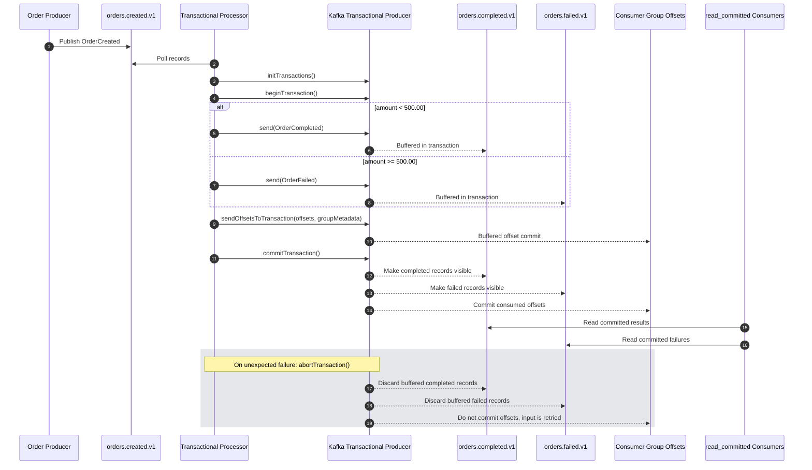

# Transactional Processor

## Purpose

Demonstrate Kafka transactions and exactly-once processing for a Kafka-to-Kafka order workflow.

The processor consumes `orders.created.v1`, applies a deterministic order rule, produces a terminal result, and commits the consumed offsets in the same Kafka transaction:

- orders below `500.00` go to `orders.completed.v1`
- orders at or above `500.00` go to `orders.failed.v1`

This gives exactly-once behavior inside Kafka: downstream consumers using `isolation.level=read_committed` see output records only after the transaction commits, and the input offsets are committed atomically with those output records.

## Sequence Diagram



## Run

Start the local stack and provision topics:

```bash
make up
bash scripts/wait-for-kafka.sh
make topics
make produce
```

Run the processor:

```bash
make transactional
```

Or run it directly:

```bash
./mvnw -pl plain-java/transactional-processor exec:java \
  -Dexec.mainClass=com.example.kafkalab.transactional.TransactionalProcessorMain
```

Custom arguments:

```bash
./mvnw -pl plain-java/transactional-processor exec:java \
  -Dexec.mainClass=com.example.kafkalab.transactional.TransactionalProcessorMain \
  '-Dexec.args=--bootstrap-servers localhost:9092 --input-topic orders.created.v1 --completed-topic orders.completed.v1 --failed-topic orders.failed.v1 --group-id order-transactional-processor --transactional-id order-transactional-processor'
```

## Important Limits

Kafka transactions cover Kafka input offsets and Kafka output records. They do not make external side effects exactly once. Database writes, HTTP calls, and emails still need their own idempotency or transactional boundary.
